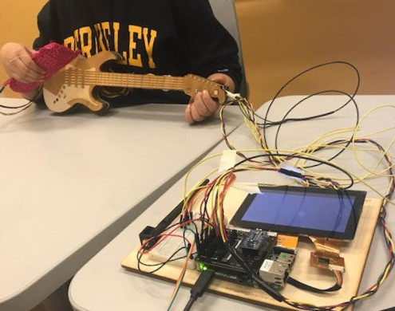
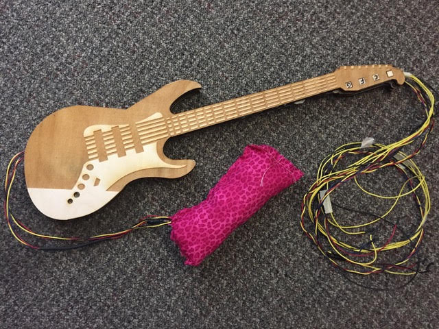
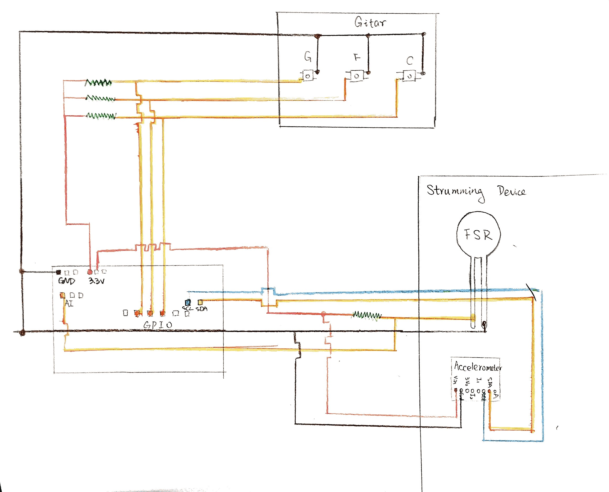
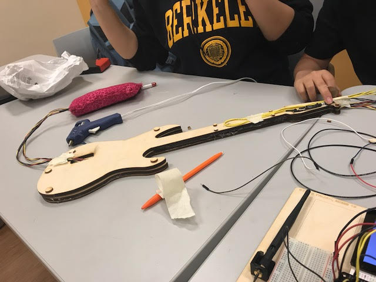
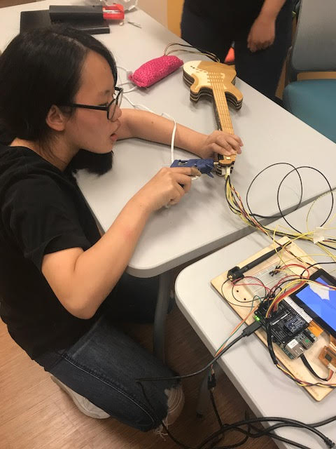
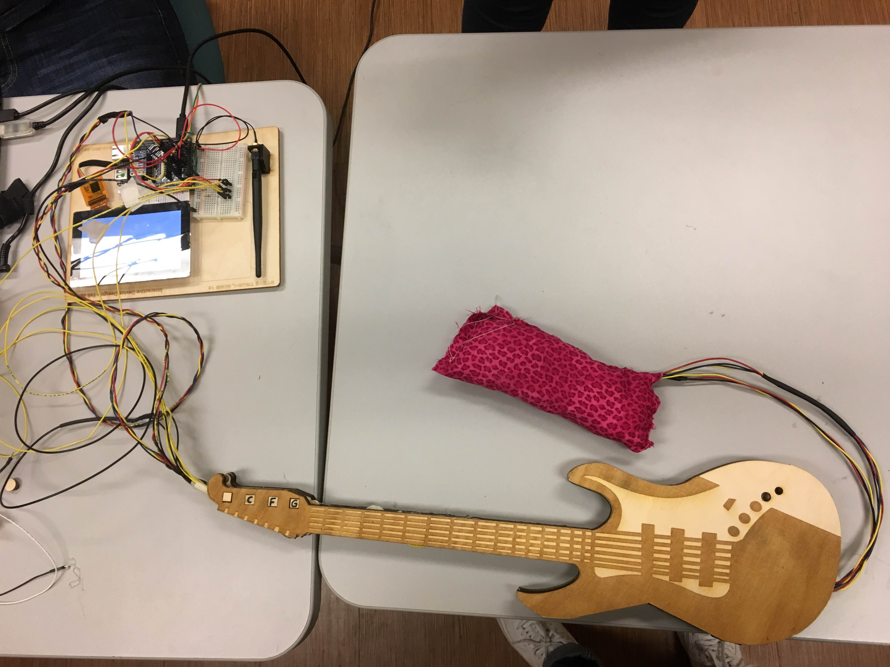

EveryoneGuitar by Steve Trush, Linlin Cai, and Yu Song
=====================================

Have you ever wanted to start playing the guitar but did you <i>fret</i> about all those strings? How can we help beginners, especially children and others lacking finger dexterity, overcome those fears to start composing songs and build the coordination and motivation for future guitar lessons?  
Introducing the EveryoneGuitar, a fun interactive device that strikes all the right chords - here is a demo:  
https://www.youtube.com/watch?v=DYG7iARvjqY

This is an interactive MIDI input device designed for Interactive Device Design (Fall 2017) at UC Berkeley. Using the Pico Pro kit, the device was built to demonstrate how we can apply analog sensors such as accelerometers and force sensitive resistors and communicate over serial connections with other devices such as a PC.

We all collaborated on the initial idea and design of the device, deciding how users would interact with the device and how the device should interact with the software synthesizer. Once we had a tentative plan, we broke up the work as follows:

<b>Steve</b>: In charge of the software, he wrote the code to read the sensors and buttons, translate the readings into appropriate MIDI messages, and sending the messages to the software synthesizer on a PC.  
<b>Linlin</b>: In charge of the hardware construction, she produced the physical configuration, laser cut, and assembled the main body of the guitar. 
<b>Yu Song</b>: In charge of the sensor integration, she built the electrical circuits including the sensors, mounted the circuits, and managed the wires/connections to the Pico Pro. Designed and fabricated the strumming device. 

<b>The control scheme we came up with:</b> 
One hand is used to press three buttons that each represent one of three triad chords: root major, major 4th, major 5th. The default key is C Major, though the key can be shifted in the software synthesizer. Holding the ComfortablePick(tm), a squeezable plush toy with their opposite hand, the user will make a strumming motion causing the software synth to play a chord. The ComfortablePick can also be squeezed to modulate the pitch of the output sound.

<b>Hardware implementation:</b>br>
For chord selection, three momentary pushbutton switches are mounted in a the end of a plywood guitar-shaped structure. The wires continue down the neck of the guitar and connect to 3 GPIO pins on the development board. For the ComfortablePick, an accelerometer is encased in a wood mount with a Force Sensitive Resistor mounted adjacent for one to manipulate with their thumb. The accelerometer and FSR are then connected to the I2C and analog A0 pin respectively. A serial to USB cable connects UART6 to a PC. The wires of strumming device go through the gitar to connect two device together. 
 
 

<b>Software implementation:</b> 
The GuitarApp.java extends the SimplePicoPro class and depends upon the SerialMidi class. After initializing readers on 4 GPIO pins, the serial connection on UART6, and analog inputs, the program enters sits in a simple loop that:
1. Detect which chord buttons are currently being pressed. Select only the most recently pressed chord to sound.
2. If a chord is being pressed, detect if the user is making a strumming motion or squeezing the pick. 
    2a. If the user is moving the accelerometer along the X or Y beyond an arbitrary acceleration threshhold, create MIDI message to turn on the notes pertaining to that chord, silencing any notes that may still be playing from the previous strum.  
    2b. If the user is squeezing the FSR beyond an arbitrary threshold, create a MIDI message increasing the pitch in inverse proportion to the read resistance.  
    2c. If the user is not strumming, but the user is still holding a chord, the synthesizer will continue to resonate those notes for 1 seconds.
3. If a chord is not being pressed, silence any sounding notes.

The MIDI messages control a software sythesizer according to this "stack":
1. MIDI message are formed and sent using the SerialMIDI class over UART6. 
2. Hairless MIDI/Serial Bridge then receives the messages on the connected PC and will forward the messages to a virtual MIDI output port instantiated using loopMIDI.
3. The MIDI output is then read by the software sythesizer: We used the open source ZynAddSubFX.
 
 
 

<b>Reflection:</b>  
This homework exercised our abilities to integrate the team's skills and products together into a working instrument. Were our efforts successfull? This is difficult to assess, much of our time to collaborate was spent making the final product actually reliably function once assembled - it really wasn't until we had close to a finished prototype that we could assess how useful our design decisions actually were. In some regards, we were successful in creating a device that could presumably ease a beginner towards the real instrument. For instance, small touches like making sure the chord is held before strumming can help hone the motor skills required for the real thing, but still our instrument can also feel somewhat limiting in the range of sounds that can be produced and in its responsiveness to the user's touch. The accelerometer is not perhaps the best tool to mimic strumming - we discussed in the team that a strum combines nuances of pressure, speed, direction, and timing to produce sounds. Even with 3 directions, boiling down strumming to acceleration over a given threshhold can feel unrealistic. 

The easiest parts of this assignment were those parts that could task organized and tackled individually: connecting circuits and wiring, writing code to read the sensors, or cutting out the physical compartments. The most challenging was being able to efficiently collaborate together and assemble the pieces into a working whole. While past assignments also forced us to use tools we had never used and branch into fields outside of our expertise, this assignment made us task organize the project between various unfamiliar teammates. The greatest lesson would be not to underestimate the time to integrate pieces and to figure out how to debug problems arising from adding in new pieces. The prototype work well when the team tested with code and breadboard. It suddenly showes error after the enclosure mounted together. To debug the problem, the enclosure was teared apart, and each button and each sensor was tested separately. Then, a pull-up resister was added to each button to stablized the signal. And the clearence between "wood button" and "real button" was modified to provide a better physical connection when push button.  

This small project also teaches us how to manage wires when there are a lot. There are seven wires come out from strumming device, and seven plus five come out of gitar. The guitar was designed awith  groove to hold all wires in the middle. However, when we tried to have everything assemble together, we found the groove wass too thin for all the wires. To solve the problem, we used spacers to provide more space between layers.  

<b>Demo video:</b> 
https://www.youtube.com/watch?v=DYG7iARvjqY

License
-------

Copyright 2016 The Android Open Source Project, Inc.

Licensed to the Apache Software Foundation (ASF) under one or more contributor
license agreements.  See the NOTICE file distributed with this work for
additional information regarding copyright ownership.  The ASF licenses this
file to you under the Apache License, Version 2.0 (the "License"); you may not
use this file except in compliance with the License.  You may obtain a copy of
the License at

  http://www.apache.org/licenses/LICENSE-2.0

Unless required by applicable law or agreed to in writing, software
distributed under the License is distributed on an "AS IS" BASIS, WITHOUT
WARRANTIES OR CONDITIONS OF ANY KIND, either express or implied.  See the
License for the specific language governing permissions and limitations under
the License.
